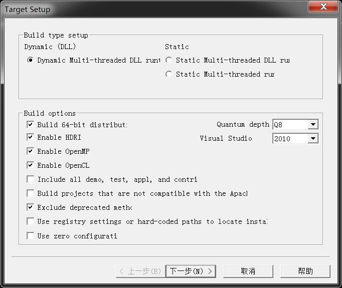

# ImageMagick

## Description
1. ImageMagick网站:http://www.imagemagick.org/script/index.php
2. 在windows下使用ImageMagick时，有时候需要从源码编译得到lib\dll库
3. 新版本的源码使用了C++11的特性，且有不少C99标准的代码，所以直接在VS2010环境下无法直接编译
4. 本源码即修改错误后在VS2010环境下编译通过的源码

## 环境
1. 原始代码来源：https://www.imagemagick.org/download/windows/ImageMagick-windows.zip，版本：ImageMagick-7.0.7-28
2. windows 7 SP1 旗舰版，64位系统
3. VS2010旗舰版(64位)

## 编译后的的库
1. 下载地址：[百度网盘](https://pan.baidu.com/s/1y41sQbxzpEl2un9gTbJOAg)
2. 生成工程的选项：
   
